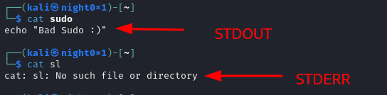
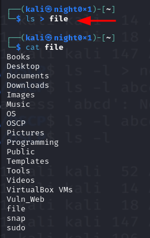
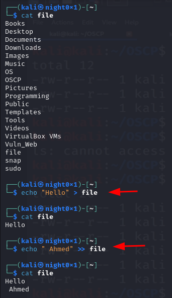
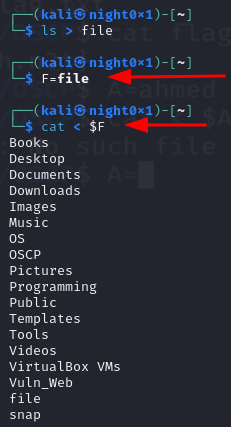
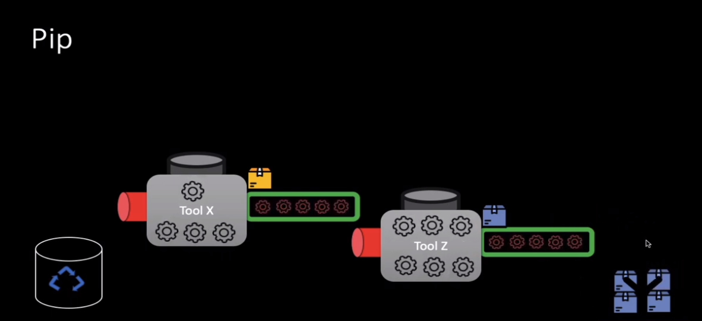
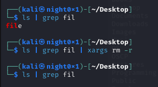

# Piping and Redirection

## 1.<mark style="color:red;">Redirect</mark>

<table><thead><tr><th>Stream Name</th><th width="255">Description</th><th></th></tr></thead><tbody><tr><td>Standard Input (STDIN)</td><td>Data fed into the program</td><td></td></tr><tr><td>Standard Output (STDOUT)</td><td>Output from the program</td><td></td></tr><tr><td>Standard Error (STDERR)</td><td>Error messages (defaults to)</td><td></td></tr></tbody></table>

#### Type Standard

1. Standard Input   <mark style="color:blue;">0 ( STDIN )</mark>
2. Standard Output    <mark style="color:green;">1  ( STDOUT )</mark>
3. Standard Error        <mark style="color:red;">2 ( STDERR )</mark>

<figure><figcaption></figcaption></figure>

* Redirecting to an Existing File

> In Case Redirect Output , U Can Using <mark style="color:red;">`>`</mark> Operator To Store Or Redirect Output In File

```bash
kali@kali:~$ echo "that is maintained and funded by Offensive Security" >>
redirection_test.txt
kali@kali:~$ cat redirection_test.txt
Kali Linux is an open source project
that is maintained and funded by Offensive Security
```

<figure><figcaption></figcaption></figure>

* **Redirecting from a File**

```sh
root@root:~$ wc -m < php.php
89
```

* Redirecting to a New File

```markdown
kali@kali:~$ ls
Desktop Documents Downloads Music Pictures Public Templates Videos
kali@kali:~$ echo "test"
test
kali@kali:~$ echo "test" > redirection_test.txt
kali@kali:~$ ls
Desktop Documents Downloads Music Pictures Public redirection_test.txt Template
kali@kali:~$ cat redirection_test.txt
test
kali@kali:~$ echo "Kali Linux is an open source project" > redirection_test.txt
kali@kali:~$ cat redirection_test.txt
Kali Linux is an open source project
```

> In Case Insert In File Not Use Override In Case Using Just <mark style="color:red;">`>`</mark> U Can Use <mark style="color:red;">`>>`</mark> To Insert In File , And Save The Old Value

<figure><figcaption></figcaption></figure>

* Redirecting <mark style="color:red;">STDERR</mark>

```sh
kali@kali:~$ ls .
Desktop Documents Downloads Music Pictures Public redirection_test.txt Template
kali@kali:~$ ls ./test
ls: cannot access '/test': No such file or directory
kali@kali:~$ ls ./test 2>error.txt
```

> in Case Passing <mark style="color:green;">STRDINT</mark> Standard Input Using <mark style="color:red;">`<`</mark>

<figure><figcaption></figcaption></figure>

## &#x20;2.<mark style="color:green;">Piping</mark>

<figure><figcaption></figcaption></figure>

> Return Result From **1st Function** Or Output _**And Passing As A Value To 2nd Tool Or Function**_

> <mark style="color:red;">`tee`</mark> Command Using To Show Result And Store In File , U Can Append In File Because IF U Use Normal Use Delete Old Data, U Can Use Switch <mark style="color:red;">`-a`</mark> To Append  <mark style="color:red;">`ls | tee -a`</mark>

> And U Can Using Other <mark style="color:red;">`xargs`</mark> To Control Result And Execute Same Actions

<figure><figcaption></figcaption></figure>


In Case Show Errors In Kali U Can Show Result And Comments In The Kali website Bugs And Search From Your Errors [https://bugs.kali.org](https://bugs.kali.org/)

\
Kali Linux adheres to the [filesystem hierarchy standard (FHS)](https://wiki.linuxfoundation.org/lsb/fhs) Which provides a familiar and universal layout for all Linux users


