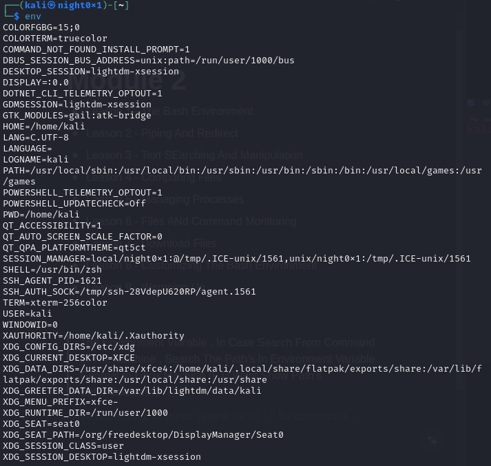
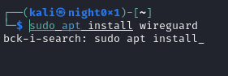

# The Bash Environment

## The Bash Environment

*   Environment Variables

    We can view the contents of a given environment variable with the echo command followed by the “$” character and an environment variable name. For example, let’s take a look at the contents of the PATH environment variable:

    ```sh
    kali@kali:~$ echo $USER
    kali
    kali@kali:~$ echo $PWD
    /home/kali
    kali@kali:~$ echo $HOME
    /home/kali
    kali@kali:~$ echo $PATH
    /usr/local/sbin:/usr/local/bin:/usr/sbin:/usr/bin:/sbin:/bin
    ```

    An environment variable can be defined with the export command. For example, if we are scanning a target and don’t want to type in the system’s IP address repeatedly, we can quickly assign it an environment variable and use that instead:

> The Environment Variable , In Case Search From Command In The Machine , Search The Path’s In Environment Variable General In Linux Machine IF U Want Show Path’s And Other Information's Enter Command <mark style="color:red;">`env`</mark>

<div>


 

<figure><figcaption></figcaption></figure>

</div>

> U Can Edit Value In Variables , Set Value Of Variable In Case Login The Machine

```bash
Name="OSCP"
echo $Name # OSCP
```

> But In Case Open New Session In The Same Terminal , Not Show This Variable

<div>


 

<figure><figcaption></figcaption></figure>

</div>

> In Case U Need Complete The Same Variable in All Sessions , Using <mark style="color:red;">`export`</mark>

<div>


 

<figure><figcaption></figcaption></figure>

</div>

> In Case U Need Remove Value From Any Variable Using <mark style="color:red;">`unset`</mark> Command

<div>


 

<figure><figcaption></figcaption></figure>

</div>

***

> General In Case Search From Command In Variable Env , Search in **1st** **Path** , IF Not Found , Search **2nd** **Path** IF Not Found Search **3rd** And , ETC … In Case Use Bad <mark style="color:red;background-color:red;">`sudo`</mark>

<div>


 

<figure><figcaption></figcaption></figure>

</div>

***

#### Bash History

> In Linux Store All Command Used In <mark style="color:red;">`history`</mark> File In Case Use Specific Command Using ID In History Use <mark style="color:blue;">`!`</mark>

<div>


 

<figure><figcaption></figcaption></figure>

</div>

> In Case Type The ID Command From History And Type Enter , Show The Command , If U Need Update In Case Type The ID Command And Type Space , Convert To The Command If U Need Edit

***

> In Case Type <mark style="color:blue;">`!!`</mark> Use The Last Command In History File, Or Use The Last ID Command

<div>


 

<figure><figcaption></figcaption></figure>

</div>

***

> In Case Type <mark style="color:red;">`Ctrl+r`</mark> Open Search In Command In Terminal After Used

<div>


 

<figure><figcaption></figcaption></figure>

</div>

***

> U Can Separate 1st Command And 2nd Command Using Semicolon <mark style="color:red;">`;`</mark> It doesn't matter if the first thing ended properly or not

```bash
ls ; ls
```

> Execute a specific command, and if it succeeds, another specific command is executed. In the event of failure, the execution will not be completed Using <mark style="color:red;">`&&`</mark>

```bash
cdc && ls # Not Execute ls Command 
cd .. && ls # In Case Not Return Error Execute ls Command
```
